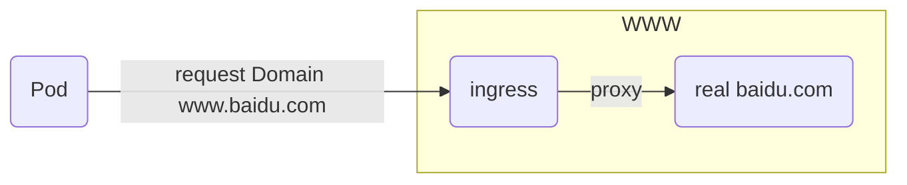
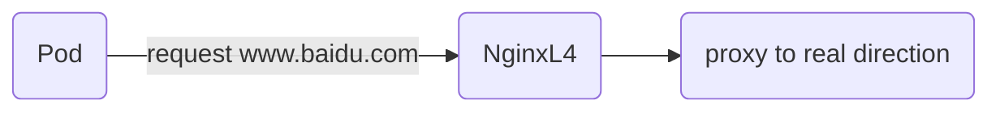

̌[summary:](#summary)
- [summary:](#summary)
- [config description](#config-description)
- [prepare package and tree](#prepare-package-and-tree)
- [flow](#flow)
- [About Unbound](#about-unbound)
  - [Testing domain reslove](#testing-domain-reslove)
  - [edit pod reslov.conf keep nameserver same to /etc/unbound/unbound.conf.d/unbound.conf interface: 127.0.0.1](#edit-pod-reslovconf-keep-nameserver-same-to-etcunboundunboundconfdunboundconf-interface-127001)
  - [nginx.conf only Testing L4 forwarding request](#nginxconf-only-testing-l4-forwarding-request)
- [About Docker](#about-docker)
  - [Dockerfile configuration](#dockerfile-configuration)
  - [wrapper.sh](#wrappersh)
  - [tz error and fix methods](#tz-error-and-fix-methods)
- [other stuff](#other-stuff)

# summary:
this record contains nginx L4 installation and unbound installation

# config description
- 主配置文件的命名应该是有规则要求,如果省略默认的配置文件有要求/etc/unbound/unbound.conf
- Testing at Ubuntu /etc/unbound/unbound.conf.d/目录下 主配置文件a.conf is ok 
- Testing filename kong.conf error
- Testing merged unbound.conf and sub.conf is ok 
```
for centos:
[root@master-node unbound]# /usr/sbin/unbound-checkconf -h
Usage:	unbound-checkconf [file]
	Checks unbound configuration file for errors.
file	if omitted /etc/unbound/unbound.conf is used.
-o option	print value of option to stdout.
-f 		output full pathname with chroot applied, eg. with -o pidfile.
-h		show this usage help.
Version 1.6.6
BSD licensed, see LICENSE in source package for details.
Report bugs to unbound-bugs@nlnetlabs.nl

for ubuntu:
root@3c184cccc5a1:/# cat /etc/unbound/unbound.conf
# Unbound configuration file for Debian.
#
# See the unbound.conf(5) man page.
#
# See /usr/share/doc/unbound/examples/unbound.conf for a commented
# reference config file.
#
# The following line includes additional configuration files from the
# /etc/unbound/unbound.conf.d directory.
include: "/etc/unbound/unbound.conf.d/*.conf"
```
- 关于配置文件block-example.com.conf这部分不能和主配置文件写在一起,否则会报语法错误
```
cat block-example.com.conf                                                                                                       

# Example blocking email going out to example.com
#
local-data: "lex.in. 3600 IN MX 5 127.0.0.1"
local-data: "lex.in. 3600 IN A 127.0.0.1"
local-data: "rt.lex.in. 3600 IN A 192.168.1.23"
local-data: "gw.lex.in. 3600 IN A 192.168.1.23"
```
- unbound.conf not defined log . if defined log . need edit Dockerfile
  eg:
  directory: "/etc/unbound"
  logfile: "/var/log/unbound.log"
# prepare package and tree
- apt search netstat
- apt-get install dnsutils curl net-tools -y [for dig curl netstat command]
- wget http://nginx.org/download/nginx-1.20.1.tar.gz
- docker build -t lex:nginx ./
- docker build -t lex:dns ./
- tree
```
/share/Web/gke-nginx # tree                                                                             
.
├── block-example.com.conf
├── Dockerfile
├── nginx-1.20.1.tar.gz
├── nginx.conf
├── sub.conf
├── unbound.conf
└── wrapper.sh

0 directories, 7 files
```
# flow 
- pod request hardcode hosts www.baidu.com:443 ==> upstream to real www.baidu.com:443
- Pod request domain Throughout unbound dns server ==> NginxL4 server
- why using www.baidu.com this for ssl certificate



# About Unbound 
## Testing domain reslove
dig @0.0.0.0 web.lex.in 10.0.3.9
dig @0.0.0.0 www.lex.in.

## edit pod reslov.conf keep nameserver same to /etc/unbound/unbound.conf.d/unbound.conf interface: 127.0.0.1
```bash
root@3c184cccc5a1:/etc/unbound/unbound.conf.d# cat /etc/resolv.conf
nameserver 127.0.0.1
; <<>> DiG 9.16.1-Ubuntu <<>> @0.0.0.0 www.lex.in.
```
## nginx.conf only Testing L4 forwarding request 
- 因为证书问题,我测试百度域名直接从我的集群中找一个主机
- 假如我的环境中有一个DNS可以让nas-tools寻找www.baidu.com DNS记录的时候找到我的proxy IP 10.0.3.9 那么问题解决
- 解决上面的问题就是unbound
```
root@NASLEX:/nas-tools $ cat /etc/host 
10.0.3.9 www.baidu.com
root@NASLEX:/nas-tools $ curl -vs https://www.baidu.com
*   Trying 10.0.3.9:443...
* Connected to www.baidu.com (10.0.3.9) port 443 (#0)
* ALPN: offers h2
* ALPN: offers http/1.1
*  CAfile: /etc/ssl/certs/ca-certificates.crt
```
- 对应的nginx.conf配置如下 only L4 proxy server
```
root@3c184cccc5a1:/etc/nginx/logs# cat /etc/nginx/nginx.conf
worker_processes  1;
error_log  logs/error.log  info;
events {
    worker_connections  1024;
}

stream {
    log_format basic '$remote_addr [$time_local] '
                     'protocol $status $bytes_sent $bytes_received '
                     '$session_time '
                     'ssl_preread_server_name $server_port ';
    resolver 0.0.0.0;
    server {
        listen 443;
        ssl_preread on;
        proxy_connect_timeout 5s;
        proxy_pass $ssl_preread_server_name:$server_port;
        access_log /var/log/nginx/access.log basic;
    }
}
http {
    include       mime.types;
    default_type  application/octet-stream;
    sendfile        on;
    keepalive_timeout  65;
    log_format  main  '$remote_addr - $remote_user [$time_local] "$request" '
                      '$status $body_bytes_sent "$http_referer" '
                      '"$http_user_agent" "$http_x_forwarded_for"';
}
```

- request log
```log
root@3c184cccc5a1:/etc/nginx/logs# ls
error.log
root@3c184cccc5a1:/etc/nginx/logs# cat error.log
2023/01/11 12:15:02 [info] 3259#3259: *3416 client 10.0.3.9:32814 connected to 0.0.0.0:443
2023/01/11 12:15:02 [info] 3259#3259: *3416 proxy 10.0.3.9:49094 connected to 14.215.177.38:443
2023/01/11 12:15:02 [info] 3259#3259: *3416 client disconnected, bytes from/to client:263/8221, bytes from/to upstream:8221/780
2023/01/11 12:16:06 [info] 3259#3259: *3418 client 10.0.3.1:46718 connected to 0.0.0.0:443
2023/01/11 12:16:06 [error] 3259#3259: *3418 no host in upstream ":443", client: 10.0.3.1, server: 0.0.0.0:443, bytes from/to client:0/0, bytes from/to upstream:0/0
2023/01/11 12:16:49 [info] 3259#3259: *3419 client 10.0.3.1:46946 connected to 0.0.0.0:443
2023/01/11 12:16:49 [info] 3259#3259: *3419 proxy 10.0.3.9:49656 connected to 14.215.177.38:443
2023/01/11 12:16:49 [info] 3259#3259: *3419 client disconnected, bytes from/to client:263/8221, bytes from/to upstream:8221/780
2023/01/11 12:19:25 [info] 3259#3259: *3421 client 10.0.3.1:47746 connected to 0.0.0.0:443
2023/01/11 12:19:25 [info] 3259#3259: *3421 proxy 10.0.3.9:50462 connected to 14.215.177.38:443
2023/01/11 12:19:25 [info] 3259#3259: *3421 client disconnected, bytes from/to client:263/8221, bytes from/to upstream:8221/780
```

# About Docker 
## Dockerfile configuration
- need notice logs 
- need add ops tools 
```bash
FROM ubuntu:20.04
MAINTAINER lex@test.com
ARG DEBIAN_FRONTEND=noninteractive
ENV TZ=Asia/Shanghai
RUN mkdir /tmp/nginx/ && apt-get update && apt-get install build-essential libpcre3 libpcre3-dev zlib1g zlib1g-dev libssl-dev libgd-dev libxml2 libxml2-dev uuid-dev make unbound dnsutils curl net-tools -y
ADD nginx-1.20.1.tar.gz /tmp/nginx
RUN mkdir -p /var/log/nginx/ && chmod -R 755 /var/log/nginx/ && touch /var/log/nginx/error.log && touch /var/log/nginx/access.log && chmod 755 /var/log/nginx/error.log && chmod 755 /var/log/nginx/access.log && cd /tmp/nginx/nginx-1.20.1 && ./configure --prefix=/etc/nginx --sbin-path=/usr/sbin/nginx --modules-path=/usr/lib/nginx/modules --conf-path=/etc/nginx/nginx.conf --pid-path=/var/run/nginx.pid --lock-path=/var/run/nginx.lock --with-http_ssl_module --with-http_stub_status_module --with-http_realip_module --with-threads --with-stream --with-stream_ssl_preread_module --with-stream_ssl_module --with-debug  && make && make install && cd && rm -fr /tmp/nginx && apt-get clean && apt-get autoclean && ln -sf /dev/stderr /var/log/nginx/error.log && ln -sf /dev/stdout /var/log/nginx/access.log
COPY nginx.conf /etc/nginx/nginx.conf
COPY unbound.conf /etc/unbound/unbound.conf.d/
COPY block-example.com.conf /etc/unbound/unbound.conf.d/
COPY sub.conf /etc/unbound/unbound.conf.d/
#forward request and error logs to docker log collector
#RUN ln -sf /dev/stderr /var/log/nginx/error.log && ln -sf /dev/stdout /var/log/nginx/access.log

EXPOSE 443
COPY wrapper.sh /opt/wrapper.sh
RUN chmod +x /opt/wrapper.sh
CMD /opt/wrapper.sh
```

## wrapper.sh
```bash
#!/bin/bash
#base ubuntu package to build unbound and nginx
#https://docs.docker.com/config/containers/multi-service_container/
/usr/sbin/nginx -V
/usr/sbin/nginx &
status=$?
if [ $status -ne 0 ]; then
  echo "Failed to start nginx: $status"
  exit $status
fi
/usr/sbin/unbound-anchor -a /var/lib/unbound/root.key
/usr/sbin/unbound
tail -f /dev/null
```
## tz error and fix methods
- error
```
Please select the geographic area in which you live. Subsequent configuration
questions will narrow this down by presenting a list of cities, representing
the time zones in which they are located.

  1. Africa      4. Australia  7. Atlantic  10. Pacific  13. Etc
  2. America     5. Arctic     8. Europe    11. SystemV
  3. Antarctica  6. Asia       9. Indian    12. US
- fixed add to Dockerfile
ARG DEBIAN_FRONTEND=noninteractive
ENV TZ=Asia/Shanghai

docker images -a                                                                         
REPOSITORY                           TAG             IMAGE ID       CREATED          SIZE
lex                                  nginx           eea20a9dfcbd   5 minutes ago    547MB

docker stop 83d469ca5e80
docker run -itd -p 8888:443 --name=unbound lex:nginx                                     
83d469ca5e803e80d9aad0ddc8cefdd5f4a4b8f6b4623e4eb2d698f23037bdf3
/share/Web/gke-nginx # docker run -itd -p 8888:443 --name=dns lex:dns                  
/share/Web/gke-nginx # docker exec -it 83d469ca5e80 /bin/bash                                                   
root@83d469ca5e80:~# cd /etc/unbound/unbound.conf.d/
root@83d469ca5e80:/etc/unbound/unbound.conf.d# cat << EOF > common.conf

server:
port: 53
verbosity: 0
num-threads: 2
outgoing-range: 512
num-queries-per-thread: 1024
msg-cache-size: 32m
interface: 0.0.0.0
rrset-cache-size: 64m
cache-max-ttl: 86400
infra-host-ttl: 60
infra-lame-ttl: 120
access-control: 127.0.0.0/8 allow
access-control: 0.0.0.0/0 allow
username: unbound
directory: "/etc/unbound"
logfile: "/var/log/unbound.log"
use-syslog: no
hide-version: yes
so-rcvbuf: 4m
so-sndbuf: 4m
do-ip4: yes
do-ip6: no
do-udp: yes
do-tcp: yes
remote-control:
control-enable: yes
control-port: 953
control-interface: 0.0.0.0


root@83d469ca5e80:/etc/unbound/unbound.conf.d# cat << EOF > common.conf


Testing ruquest:

root@83d469ca5e80:/etc/nginx# curl -kv https://www.baidu.com
*   Trying 10.0.3.9:443...
* TCP_NODELAY set
* Connected to www.baidu.com (10.0.3.9) port 443 (#0)
* ALPN, offering h2
* ALPN, offering http/1.1
* successfully set certificate verify locations:
*   CAfile: /etc/ssl/certs/ca-certificates.crt
  CApath: /etc/ssl/certs
* TLSv1.3 (OUT), TLS handshake, Client hello (1):
* TLSv1.3 (IN), TLS handshake, Server hello (2):
* NPN, negotiated HTTP1.1
* TLSv1.2 (IN), TLS handshake, Certificate (11):
* TLSv1.2 (IN), TLS handshake, Server key exchange (12):
* TLSv1.2 (IN), TLS handshake, Server finished (14):
* TLSv1.2 (OUT), TLS handshake, Client key exchange (16):
* TLSv1.2 (OUT), TLS change cipher, Change cipher spec (1):
* TLSv1.2 (OUT), TLS handshake, Next protocol (67):
* TLSv1.2 (OUT), TLS handshake, Finished (20):
* TLSv1.2 (IN), TLS handshake, Finished (20):
* SSL connection using TLSv1.2 / ECDHE-RSA-AES256-GCM-SHA384
* ALPN, server did not agree to a protocol
* Server certificate:
*  subject: C=CN; ST=ShenZhen; L=ShenZhen; O=XiaoMi; OU=XiaoMi; CN=www.miwifi.com
*  start date: Jun 28 08:08:17 2020 GMT
*  expire date: Jun 26 08:08:17 2030 GMT
*  issuer: C=CN; ST=ShenZhen; L=ShenZhen; O=XiaoMi; OU=XiaoMi; CN=www.miwifi.com
*  SSL certificate verify result: EE certificate key too weak (66), continuing anyway.
> GET / HTTP/1.1
> Host: www.baidu.com
> User-Agent: curl/7.68.0
> Accept: */*
>
* Mark bundle as not supporting multiuse
< HTTP/1.1 200 OK
< Server: nginx/1.2.2
< Date: Tue, 10 Jan 2023 09:38:14 GMT
< Content-Type: text/html
< Content-Length: 7382
< Connection: close
< Accept-Ranges: bytes
< Cache-Control: no-cache
< Etag: "1cd6-5480030886bc0"
< Expires: Thu, 01 Jan 1970 00:00:01 GMT
< Last-Modified: Wed, 08 Feb 2017 07:55:35 GMT
< P3p: CP=" OTI DSP COR IVA OUR IND COM "
< P3p: CP=" OTI DSP COR IVA OUR IND COM "
< Set-Cookie: BAIDUID=6BAA28829AF5141FB6FBB7611FD69319:FG=1; expires=Wed, 10-Jan-24 09:38:14 GMT; max-age=31536000; path=/; domain=.baidu.com; version=1
< Set-Cookie: BAIDUID=6BAA28829AF5141F1D81D0A1BF73F99B:FG=1; expires=Wed, 10-Jan-24 09:38:14 GMT; max-age=31536000; path=/; domain=.baidu.com; version=1
< Vary: Accept-Encoding,User-Agent
< MiCGI-Switch: 1 0
< MiCGI-Upstream: www.baidu.com
< MiCGI-Client-Ip: 192.168.31.88
< MiCGI-Host: www.baidu.com
< MiCGI-Http-Host: www.baidu.com
< MiCGI-Server-Ip: 192.168.31.1
< MiCGI-Server-Port: 443
< MiCGI-Status: AUTOPROXY
< MiCGI-Preload: no
<
```
# other stuff
```
动态添加：Version 1.5.1
rt root@vm01-03:/etc/unbound# unbound-control -c /etc/unbound/unbound.conf local_data rt.kuaiyong.in A 192.168.1.23

ok

local-zone: "lex.in." static
local-data: "lex.in. SOA ns1.lex.in. root.lex.in. 100 2000 1000 1000 360"
local-data: "lex.in. NS ns1.lex.in."
local-data: "ns1.lex.in. A 10.0.3.9"
local-data: "gw.lex.in A 192.168.1.1"
local-data: "rt.lex.in A 192.168.1.23"


/var/lib/unbound/root.key: No such file or directory
```